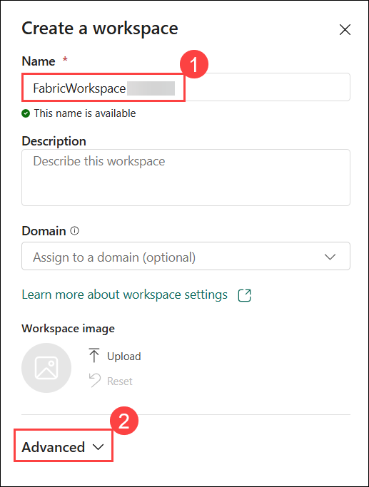
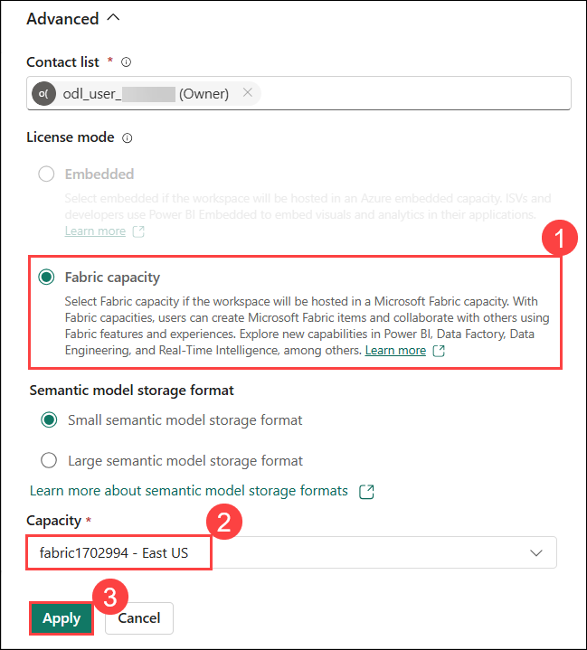
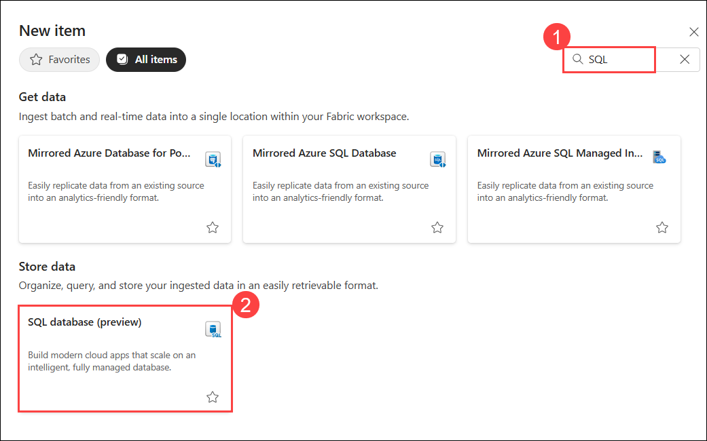
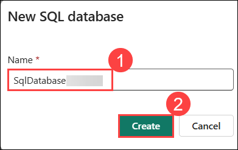

# Exercise 1: Creating a Fabric Workspace and SQL Database

In this exercise, you will learn how to log into the Microsoft Fabric portal, create a new Fabric workspace, set up a SQL database, and load sample data into the database.

## Task 1: Create the Microsoft Fabric Workspace

1. On the **Microsoft Fabric Home** page, click **+ New workspace** to create a new workspace.

    

3. Enter the workspace name as **FabricWorkspace<inject key="DeploymentID"> enableCopy="false"/>**, then click or expand **Advanced** to assign the license mode for the Fabric workload.

    

4. Choose **Fabric capacity** and select the available Capacity from the dropdown list then click **Apply**. 

    

    > **Note:** If a task flows preview feature notification appears, click **Got it** to proceed. 

    

## Task 2: Create the Azure SQL Database in Microsoft Fabric

1. On the Microsoft Fabric Workspace page, click the **+ New item** button on the top right of the page.

    

1. To create a SQL Database in Microsoft Fabric type **SQL** in the search bar, then scroll to the "Store data" section and select **SQL database (preview)**.

    

    >Note: There may be a delay after pressing the **SQL database (preview) tile** and when the **New SQL database modal** appears. Just give it a few seconds if it does not appear immediately.

1. In the **New SQL database** dialog window, enter the name as **SqlDatabase<inject key="DeploymentID"> enableCopy="false"/>**, then click the **Create** button to proceed with database creation.

    

1. Once the database has finished creating, you will be redirected to its home page, where you can view database objects and create T-SQL statements directly within the web browser.

    

    

## Task 3: Loading the SQL database with sample data

1. To add sample data to the database, click the **Sample data** tile available on the SQL database home page. This allows you to quickly populate the database with predefined tables and data for testing and exploration.

    

1. Once the sample data starts loading, a notification appears in the **upper right corner** of the database home page indicating that the process has started.

    

2. Allow this to run for about **30–60 seconds** until you see a notification stating **Successfully imported sample data**.
    
    

    > **Note:** If the notification is hidden or not visible, click on the **bell icon** in the top-right corner to view it..

4. After the data is successfully loaded, the **middle of the home page** will update to display a **"Query, preview, or connect your data"** message along with an image.

    

### Summary

In this exercise, you learned how to create a workspace, create SQL database, and load sample data in SQL database.These steps gave you hands-on experience in setting up Workspace and SQL Database using Microsoft Fabric.

Now, click on **Next** from the lower right corner to move on to the next page.

