# Exercise 1: Creating a Workspace and SQL Database

In this section of the workshop, you will be logging into the Microsoft Fabric Portal, creating a new Fabric Workspace and create SQL Database.

## Task 1: Create the Microsoft Fabric Workspace

1. Using a web browser, please navigate to this [Microsoft Fabric link](https://app.fabric.microsoft.com/home?experience=fabric-developer).

1. A **Welcome to the fabric view** dialog box will appear, click on **Cancel**.

    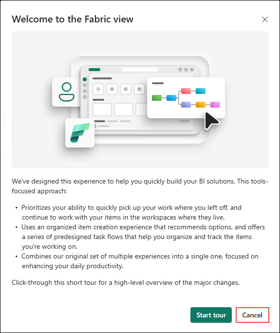

1. Click on the **Profile icon (1)** at the top right corner and absorve that **Licence type: Free account (2)** has been provided with 60-day free trial.

    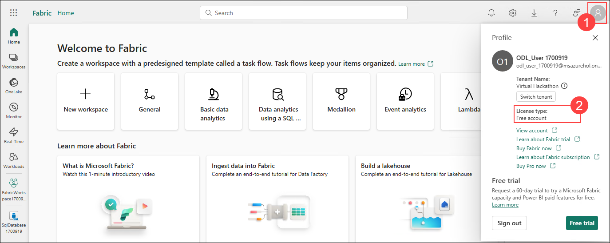

1. click the **New Workspace** to open the **Create a workspace blade** on the right side.

    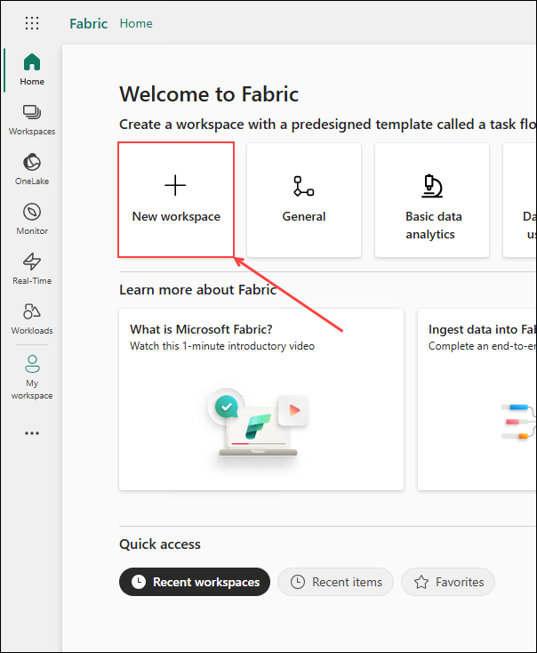

1. **Create a workspace blade** will be opened in right side of window. 

    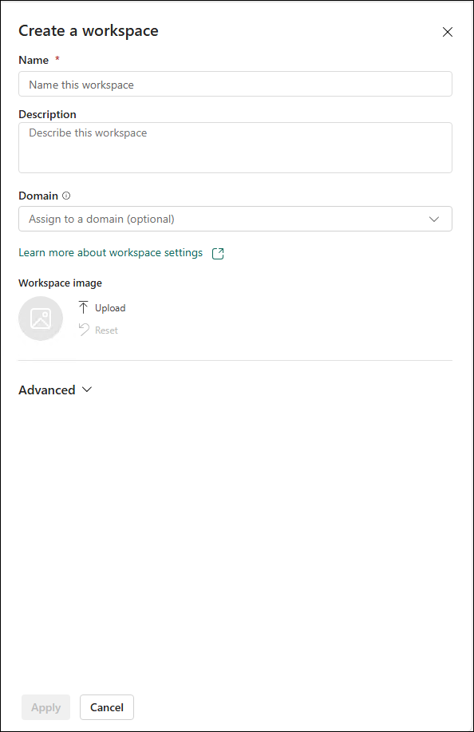

    Double check to make sure the cursor is in the **Name** field.

    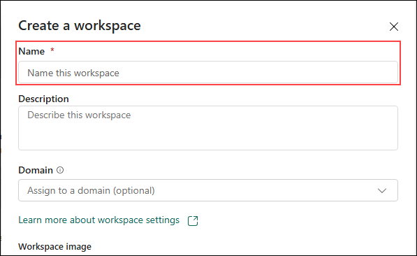

1. Provide the name as **FabricWorkspace<inject key="DeploymentID"></inject>**

    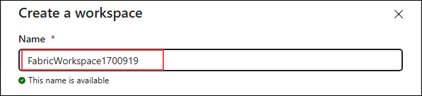

1. Next, click the green **Apply** button on the **bottom left** of the Create a workspace blade.

    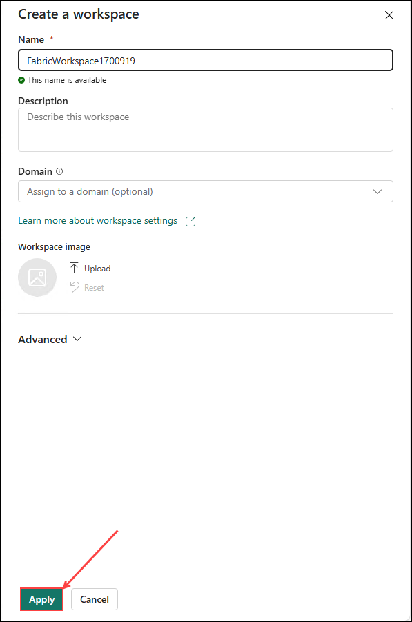

1. On the following page, you may get a popup titled **Introducing task flows (preview)**. Click the green **Got it** button.

    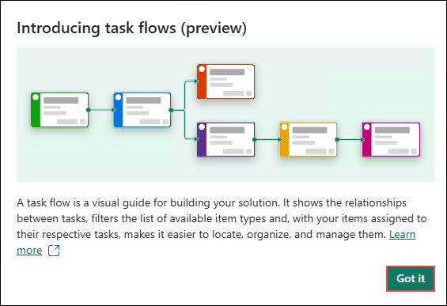

## Task 2: Create the Azure SQL Database in Microsoft Fabric

1. On the Microsoft Fabric Workspace page, click the **+ New item** button on the top right of the page.

    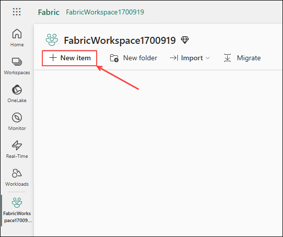

1. In the **New item** blade on the right, 

    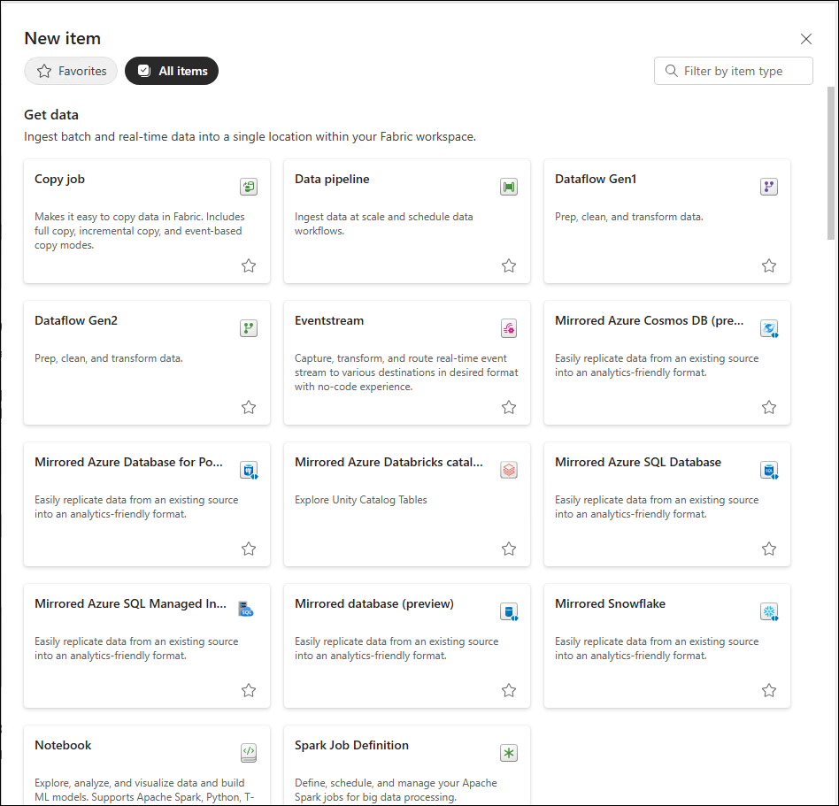

    use the **Filter by item type search box** in the upper right
    
    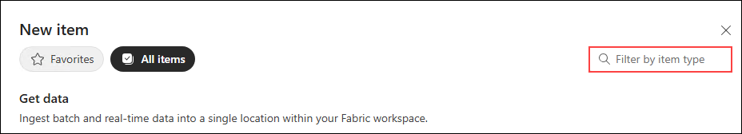
    
    to enter **SQL**

    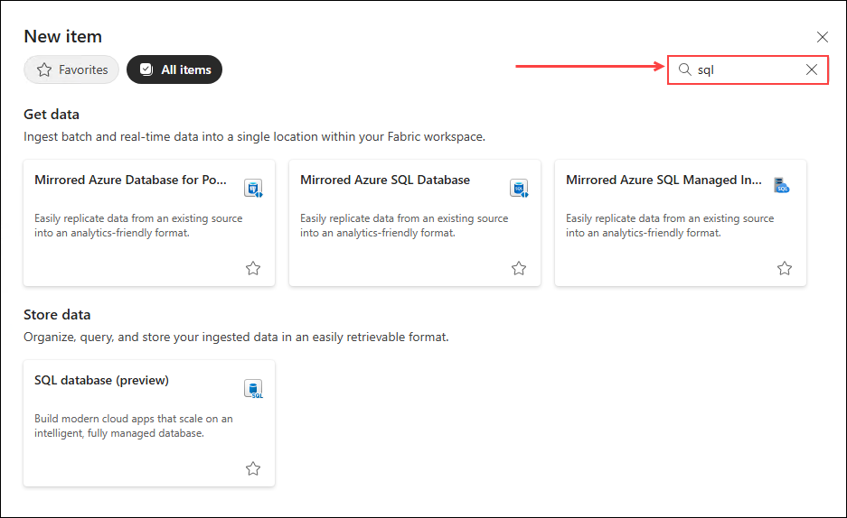

1. With the New item results filtered down, click on the **SQL database (preview)** tile.

    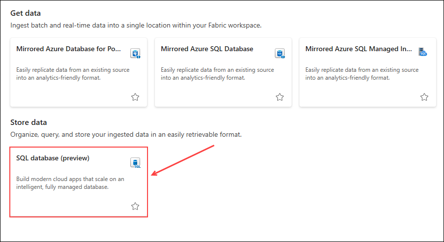

    >Note: There may be a delay after pressing the **SQL database (preview) tile** and when the **New SQL database modal** appears. Just give it a few seconds if it does not appear immediately.

1. In the **New SQL database** dialog window,

    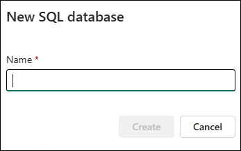

    Use a unique name as **SqlDatabase<inject key="DeploymentID"></inject>** **(1)** and click the green **Create** button.

    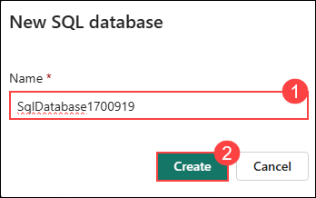

1. Once the database is finished creating,

    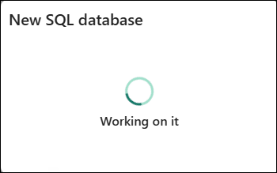

    you will be taken to that SQL database's home page where we can see database objects and create T-SQL statements right in the web browser.

    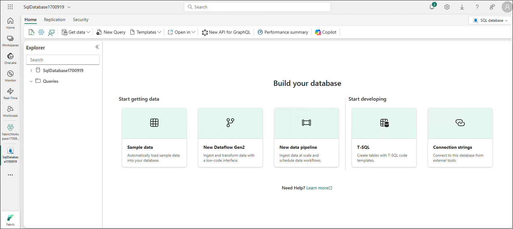

## Task 3: Loading the SQL database with sample data

1. We need some sample data in the database to work with. We can easily do this with the **Sample data** tile right on the database home page. Click the **Sample data** tile right on the database home page.

    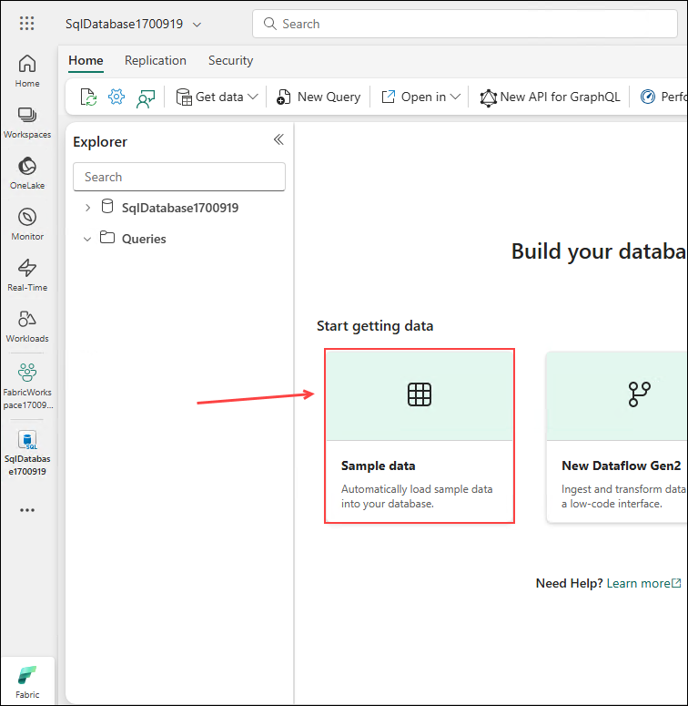

1. In the upper right corner of the database home page, you will see a notification indicating that the data is being loaded into the database.

    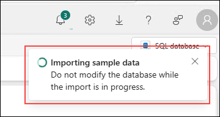

1. Allow this process to run (about 30-60 seconds) until you see a notification in the upper right corner as **Successfully imported sample data** indicating that the data was successfully loaded into the database. 
    
    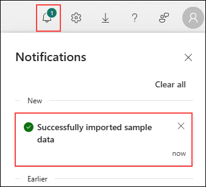

    > Note: click on the **bell icon** if notification is hidden or not visible.

1. Also, once the data has finished loading, the middle of home page will change show a **Query, preview, or connect your data** message and image.

    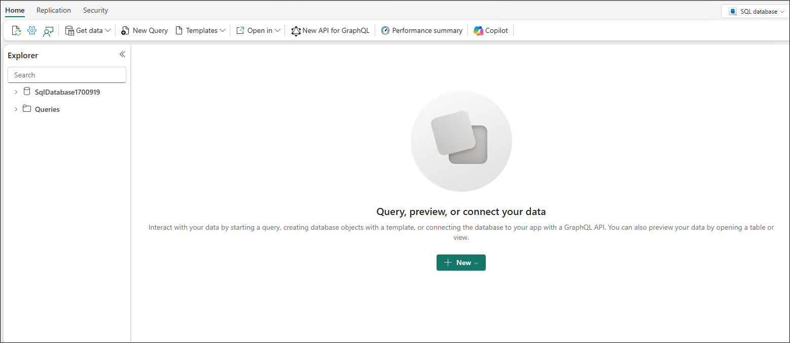

### Summary

In this lab, you learned how to create a workspace, create SQL database, and load sample data in SQL database.These steps gave you hands-on experience in setting up Workspace and SQL Database using Microsoft Fabric.

Now, click on **Next** from the lower right corner to move on to the next page.

