# Exercise 2: Working with the Azure SQL Database in Microsoft Fabric

In this exercise, you will explore Azure SQL Database Explorer and SQL Query worksheets in Microsoft Fabric. Also, you will explore copilot integrated with Azure SQL Database Explorer.

## Task 1: Introduction to Azure SQL Database 

1. To start, look at the **Database Explorer** area on the left of the page. Here, click the dropdown arrow next to the **SqlDatabase<inject key="DeploymentID"></inject>**. 

    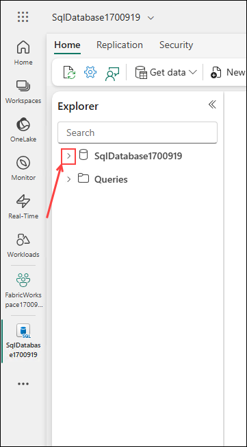

    to see a list of database schemas.

    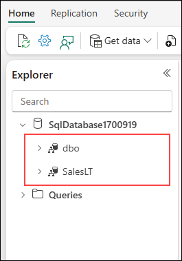

    and you can further expand the **SalesLT** schema to see object types.

    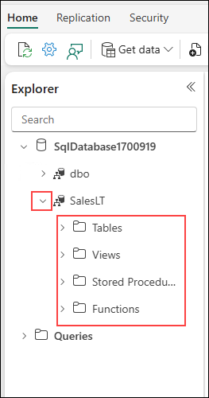

    as well as objects in the object type folders.

    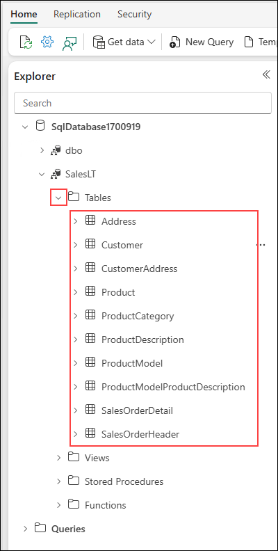

1. If not already done, expand the **SalesLT** schema, followed by expanding the **Tables** folder. Then click on the **Address** table.

    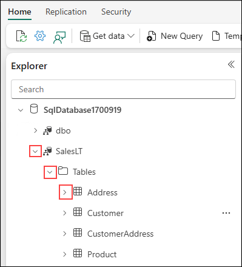

1. You can see in the editor window, a read-only **Data preview** of the contents of the Address table.

    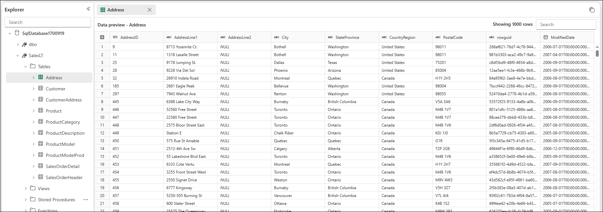

1. After browsing the data in the Address table, **close** the Data preview by clicking on the **X** next to the **Address Data preview tab**.

    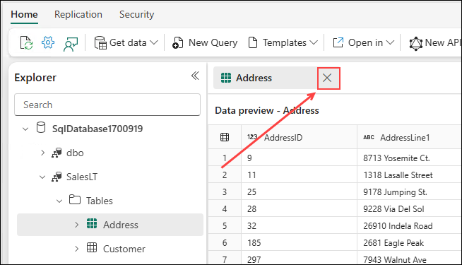

1. Now, click the **New Query** button on the toolbar
    
    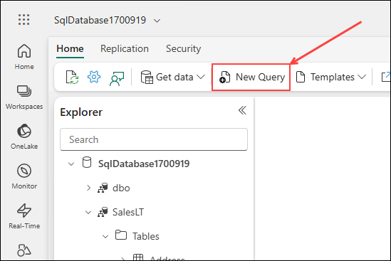

    to open a new query editor window so we can work directly with the database. 

    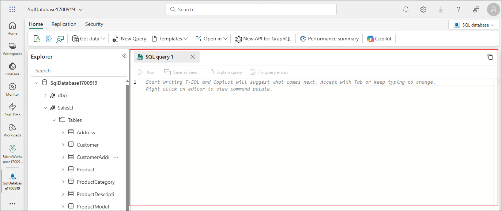

1. To remove the grey **Copilot Preview Banner**, click the X on the right side.

    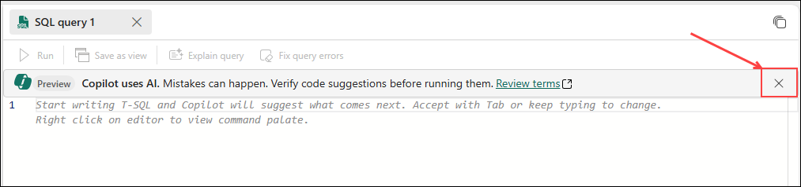

1. Once the banner is gone, be sure to click in the SQL editor sheet so that the next step will copy the code to the correct location.

    

1. Copy and paste the following code into the query editor:

    ```
    select * from [SalesLT].[Product]
    ```

1. Once the code is in the query editor, **click the Run button**.

    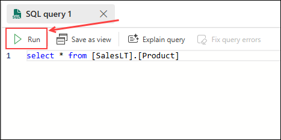

1. You will see the **results** of the query on the **bottom of the query editor**.

    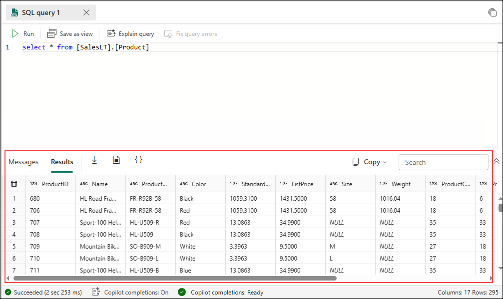

1. Starting on the left side of the **Results area**, there are 3 options for exporting the data.

    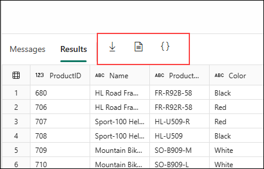

1. From left to right, first is **download results as .xlsx (Excel) file**.

    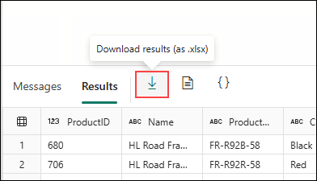

1. Next, is **download as a .csv file**

    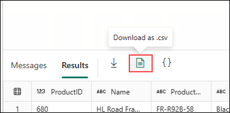

1. With the last option being **download as a .json file**.

    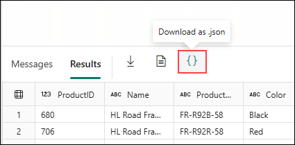

1. And the right side of the results area, you can use the **Copy** button to copy the results in multiple formats.

    

1. Now, **refresh the browser page** by clicking the refresh icon on the Edge Browser toolbar.

    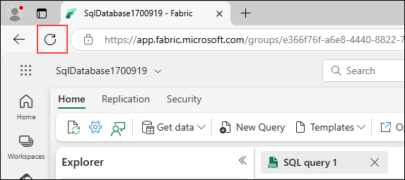

1. The query editor you were working with is no longer in the main window

    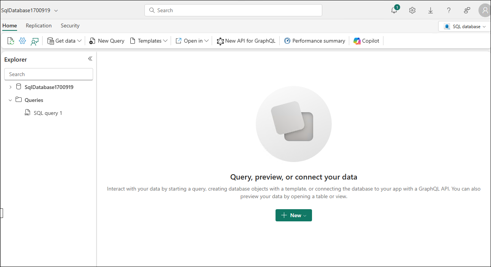

    but we can easily bring it back, or any other query editors we have been working with. We can do this by **clicking on the editor sheet name in Explorer** on the left side of the page in the **Queries folder**.

    

1. Also, by **clicking on the 3 dots** next to a query editor sheet name, you can duplicate it, rename it, or delete it.

    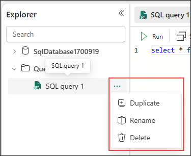

1. To get ready for the next section, **Delete** any SQL you have in **the query editor** so that it is blank. Do not delete the entire query sheet.

    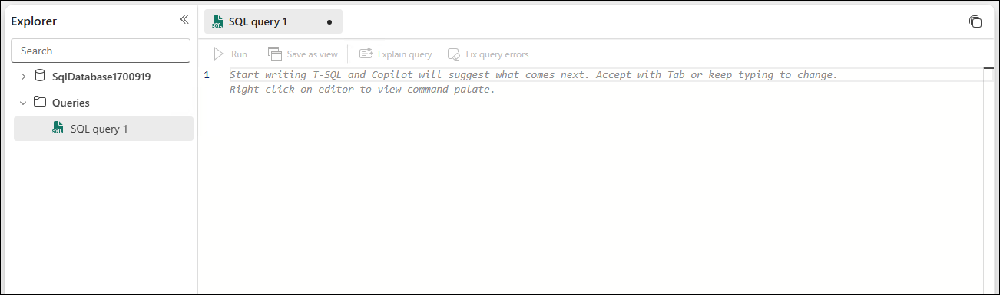

## Task 2: Copilot for the SQL Database in Microsoft Fabric

Microsoft Copilot for SQL database in Fabric is an AI assistant designed to streamline your database tasks.

### Copilot Chat

Use the chat pane to ask questions to Copilot through natural language. Copilot responds with a generated SQL query or natural language based on the question asked. 

- **Natural Language to SQL:** Generate T-SQL code from plain text requests, allowing users to query data without needing to know SQL syntax. 

- **Document-based Q&A:** Ask Copilot questions about general SQL database capabilities, and it responds in natural language. Copilot also helps find documentation related to your request.

1. To use **Copilot chat**, click the **Copilot button** on the Database details homepage toolbar.

    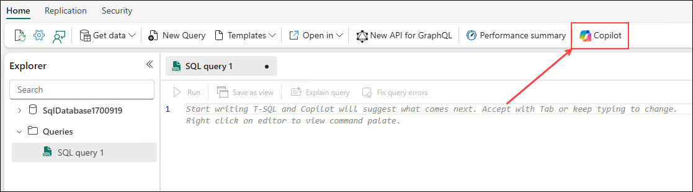

1. On the right side of the page, you will see the **Copilot Chat pane**.

    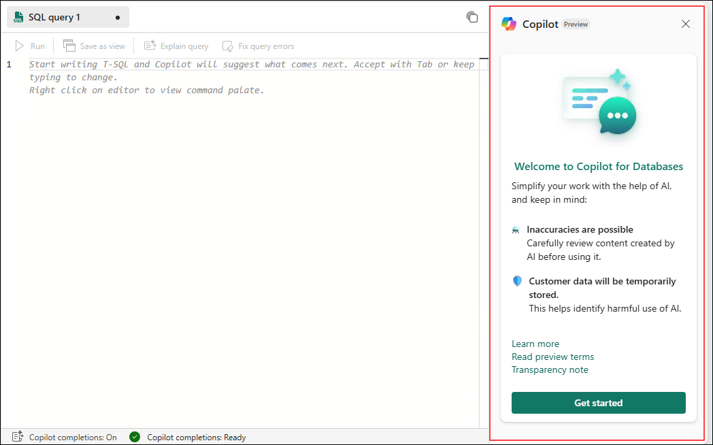

    Click the green **Get started button** on the bottom of the chat pane to continue.

    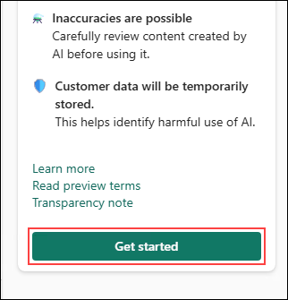

1. Let's use one of the suggested questions that the chat pane has offered us. Click the **Get Insights: Retrieve the total number of tables in my database.** button. This will add the text "Retrieve the total number of tables in my database." in the chat box on the bottom of the Chat Pane.

    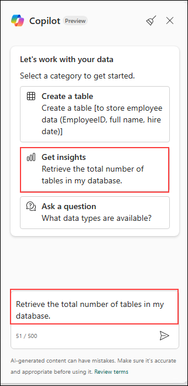

1. Once the text is in the chat text box, click the **Arrow/Paper Airplane Icon** on the right of the chat text box.

    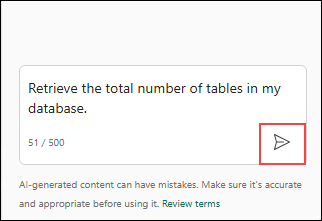

    and Copilot will start answering the question

    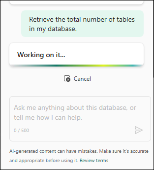

1. Once the answer is returned by Copilot,

    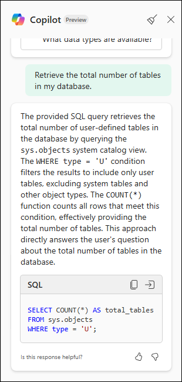

    you can either **click the copy code button** and paste it into the query editor

    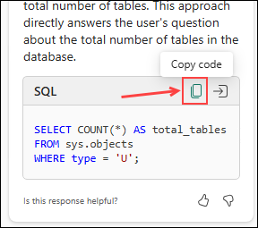

    or click the **insert code button** to have it instantly pasted into the current active query editor sheet.

    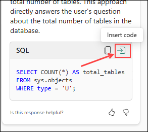

1. Once the code is copied into the query editor, you **click the run button** it to see the results.

    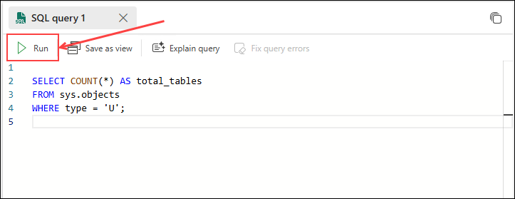

1. Try the following question suggestions in the chat pane and see the results. Feel free to run the SQL it provides from the answers, or just move on to the next question:

    > Note: Copilot for SQL database in Microsoft Fabric is in **preview** and you may encounter unexpected results. If so, try the question again or move on to the next question.

    >  

    ##### **Performance and Database Questions**

    ```Question
    What table is using the most space?
    ```

    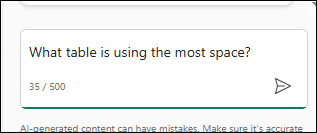

    ```Question
    Are there any poorly performing indexes?
    ```

    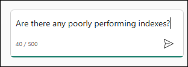

    ##### **Object Manipulation Questions**

    ```Question
    Help me create a table to store AI chat history and code to insert some sample rows?
    ```

    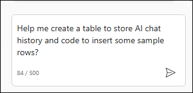

    ```
    Help me alter the Address table to add a Subdivision column.
    ```

    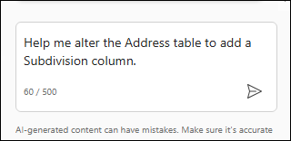

    ##### **Documentation Questions**

    ```Question
    What is an append only ledger table?
    ```

    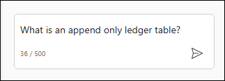

    ```Question
    Does SQL in fabric support CLR?
    ```

    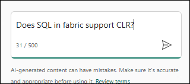

1. When done with the questions, you can **close the Copilot for SQL chat window** using the **X on the top right**.

    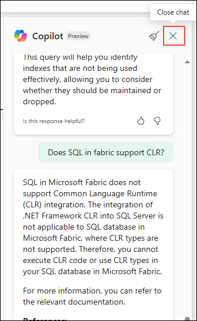

## Task 3: SQL Editor and Quick Actions

Start writing T-SQL in the SQL query editor and Copilot will automatically generate a code suggestion to help complete your query. The Tab key accepts the code suggestion or keeps typing to ignore the suggestion.

In the ribbon of the SQL query editor, the Fix and Explain options are quick actions. Highlight a SQL query of your choice and select one of the quick action buttons to perform the selected action on your query.

- **Fix:** Copilot can fix errors in your code as error messages arise. Error scenarios can include incorrect/unsupported T-SQL code, wrong spellings, and more. Copilot will also provide comments that explain the changes and suggest SQL best practices.
- **Explain:** Copilot can provide natural language explanations of your SQL query and database schema in a comments format.

1. In an empty query editor, copy and paste the following code.

    ```text
    -- list the top 5 colors of products
    ```

    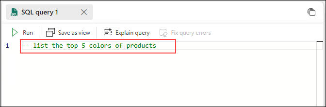

1. Then **press enter/return_the end of the line of text** in the query editor. On the bottom of the query editor, you should see that **"Copilot is working on it..."**

    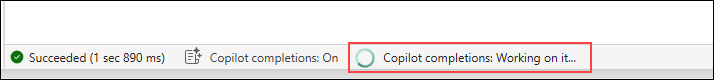

1. Back in the query editor, you should see the code Copilot generated for you

    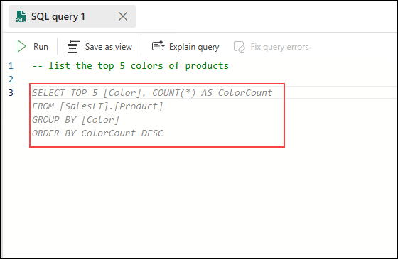

1. You can press tab to accept the code, or hover over the code with your mouse and click accept.

    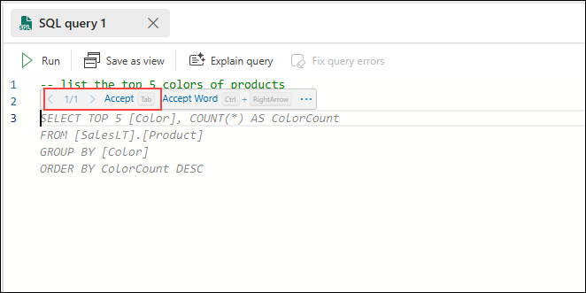

1. Once you accept the code, the color will change, indicating the code has been accepted

    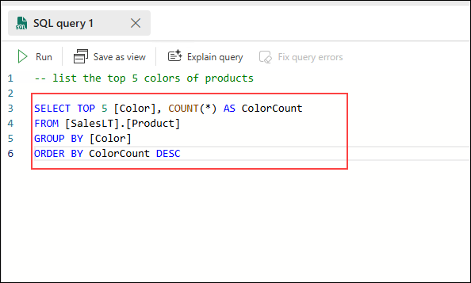

    and you can run it with the run button in the query editor to see the results.

    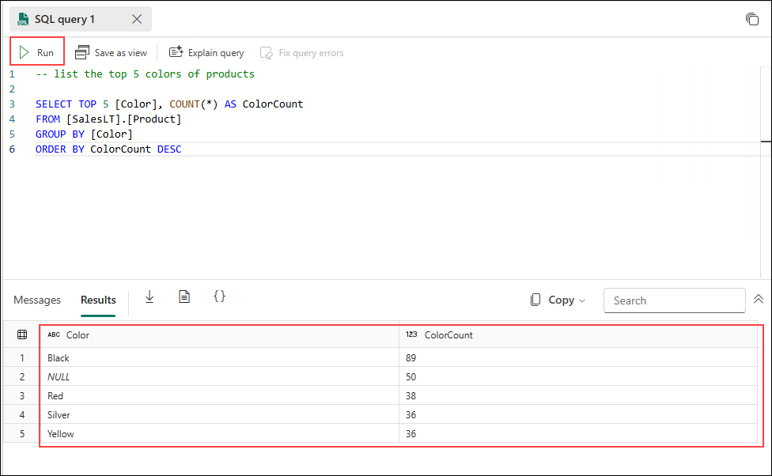

1. In an **empty query editor sheet**, try this example (remember to press return/enter after putting the statement in the query editor):

    ```text
    -- show me the top 5 customers with the most orders and their address and the number of orders
    ```

    it should provide you with code similar to the following (Remember to accept the results or press tab to accept the results):

    ```SQL
    -- show me the top 5 customers with the most orders and their address and the number of orders

    SELECT TOP 5
    C.[CustomerID],
    C.[FirstName],
    C.[LastName],
    A.[AddressLine1],
    A.[City],
    A.[PostalCode],
    COUNT(OD.[SalesOrderID]) AS OrderCount
    FROM [SalesLT].[Customer] AS C
    JOIN [SalesLT].[CustomerAddress] AS CA ON C.[CustomerID] = CA.[CustomerID]
    JOIN [SalesLT].[Address] AS A ON CA.[AddressID] = A.[AddressID]
    JOIN [SalesLT].[SalesOrderHeader] AS OH ON C.[CustomerID] = OH.[CustomerID]
    JOIN [SalesLT].[SalesOrderDetail] AS OD ON OH.[SalesOrderID] = OD.[SalesOrderID]
    GROUP BY C.[CustomerID], C.[FirstName], C.[LastName], A.[AddressLine1], A.[City], A.[PostalCode]
    ORDER BY OrderCount DESC;
    ```

1. Now, delete the **5 after the word TOP in the first line of code**. 

    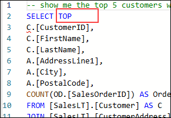

    Then use the run button to execute the SQL query.

1. You should get an error on the bottom of the page in the messages pane stating "Msg 102, Level 15, State 1, Line 4, Incorrect syntax near 'C'."

    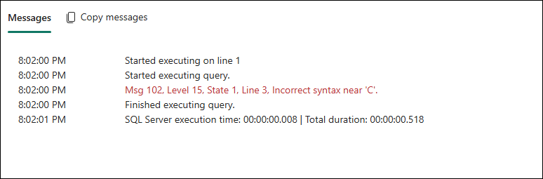

1. Back on the query editor toolbar. click the **Fix query errors** button.

    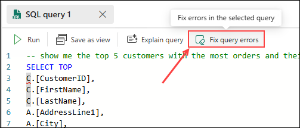

1. You will see that it added back the 5 and notated the error with how it fixed it.

    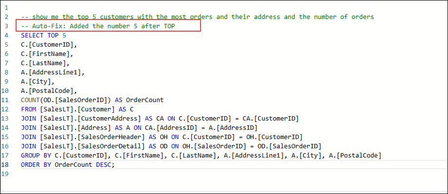

1. Next, click the **Explain query button** on the query editor toolbar.

    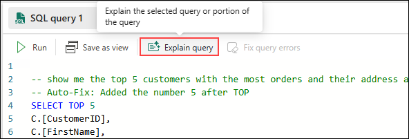

1. This option annotates your code for you, adding comments outlining the purpose/function of each section.

    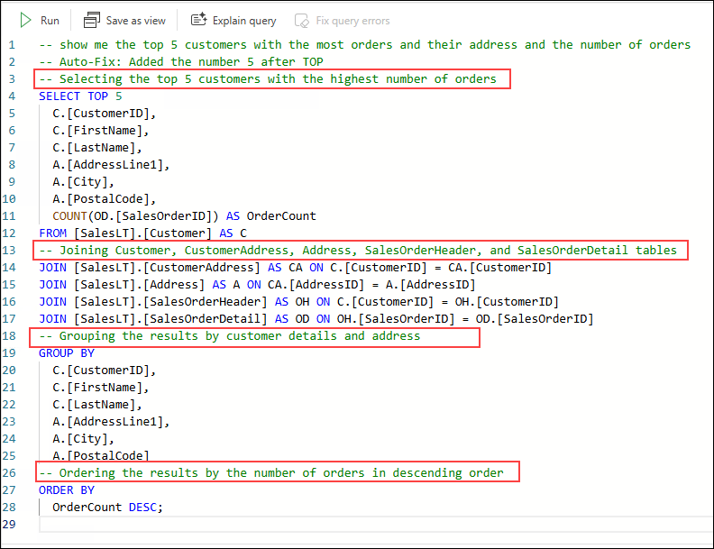

### Summary

In this exercise, you explored Azure SQL Database Explorer and SQL Query worksheets in Microsoft Fabric. Also, you learned how to use Copilot integrated with Azure SQL Database Explorer. These steps gave you hands-on experience in Azure SQL Database Explorer and SQL Query worksheets in Microsoft Fabric.

Now, click on **Next** from the lower right corner to move on to the next page.


