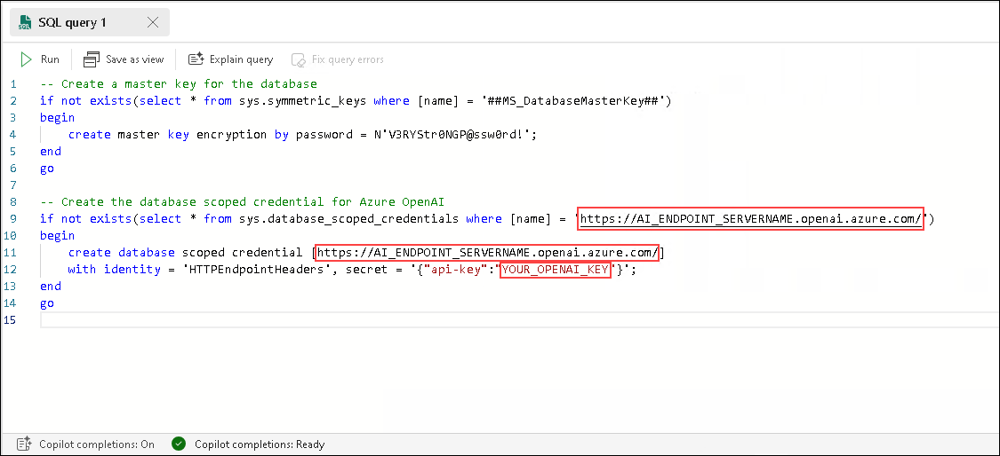
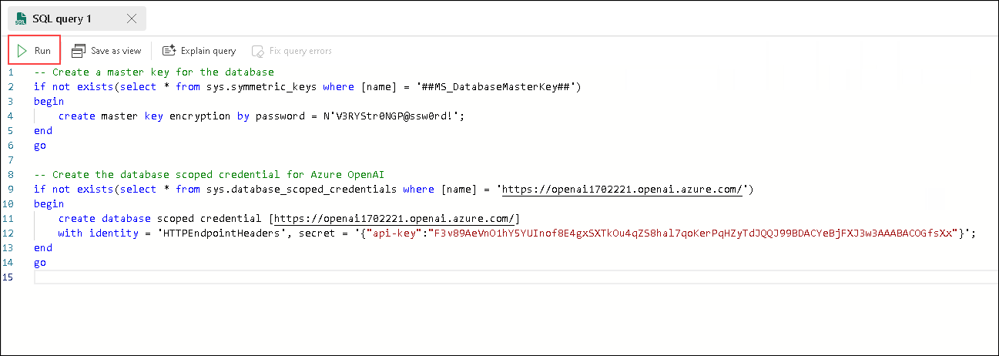
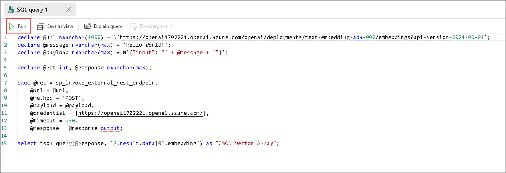

# Exercise 3: Call REST services from the Azure SQL Database in Microsoft Fabric with External REST Endpoint Invocation

Azure SQL Database External REST Endpoint Invocation provides the ability to call REST endpoints from other Azure services such as OpenAI, Azure Event Hub, Azure Functions, Power BI and more. Common use cases for developers to use External REST Endpoint Invocation are:

* Utilize Azure OpenAI services such as chat, embeddings, language, and content safety
* Ability to push business logic out of the database and into Azure Functions
* Pull/push data to/from external sources (including Azure Blob Storage) for ETL or derived data stores
* Participate in event-based architectures with Azure Event Hub or Kafka

External REST Endpoint Invocation can be called in an Azure SQL Database using the sp_invoke_external_rest_endpoint stored procedure.

## Task 1: Getting started with REST in the Azure SQL Database

In this first section, you will test the External REST Endpoint Invocation (EREI) feature of the database to ensure you have connectivity to other Azure services by asking ChatGPT for a joke. This section will also create a database scoped credential. A database scoped credential is a record in the database that contains authentication information for connecting to a resource outside the database. For this lab, we will be creating one that contains the api key for connecting to Azure OpenAI services.

### Using T-SQL to check connectivity to Azure OpenAI and creating database scoped credentials

#### Chat Completion

1. Back in the query sheet, **remove the previous code** by highlighting it and pressing delete/backspace.

1. Using an empty query sheet in Microsoft Fabric, copy and paste the following code:

    ```SQL

    -- Create a master key for the database
    if not exists(select * from sys.symmetric_keys where [name] = '##MS_DatabaseMasterKey##')
    begin
        create master key encryption by password = N'V3RYStr0NGP@ssw0rd!';
    end
    go

    -- Create the database scoped credential for Azure OpenAI
    if not exists(select * from sys.database_scoped_credentials where [name] = 'https://AI_ENDPOINT_SERVERNAME.openai.azure.com/')
    begin
        create database scoped credential [https://AI_ENDPOINT_SERVERNAME.openai.azure.com/]
        with identity = 'HTTPEndpointHeaders', secret = '{"api-key":"YOUR_OPENAI_KEY"}';
    end
    go
    ```

1. Select the **Environment** tab beside your lab guide, copy **Openaiendpoint (1)** and **OpenAIkey (2)**.

    

1. Paste the values copied in the place of highlighted lines which are the credentials of OpenAI resource.

    

1. Click on **Run** button.

    

1. The expected output is as below, the master key will be set, and the database scoped credential will be created.

    

1. Back in the query sheet, **remove the previous code** by highlighting it and pressing delete/backspace.

1. Let's test the **connectivity to Azure OpenAI** and see the ability to call external REST endpoints in action. Copy and paste the following code into a blank query editor in Microsoft Fabric:

    ```SQL
    declare @url nvarchar(4000) = N'https://AI_ENDPOINT_SERVERNAME.openai.azure.com/openai/deployments/gpt-4/chat/completions?api-version=2024-06-01';
    declare @payload nvarchar(max) = N'{"messages":[{"role":"system","content":"You are an expert joke teller."},                                   
                                       {"role":"system","content":"tell me a joke about a llama walking into a bar"}]}'
    declare @ret int, @response nvarchar(max);

    exec @ret = sp_invoke_external_rest_endpoint
        @url = @url,
        @method = 'POST', 
        @payload = @payload,
        @credential = [https://AI_ENDPOINT_SERVERNAME.openai.azure.com/],    
        @timeout = 230,
        @response = @response output;
        
    select json_value(@response, '$.result.choices[0].message.content') as "Amazing, Awesome, Stupendous Joke";
    ```
1. Paste the **Openaiendpoint** URL copied in Step 3 in the highlighted lines.

    

1. Click on **Run** button on the query sheet.

    

1. The result will be an single line joke generated by Openai model.

    

1. Next, we can use AI Translation and Content Safety.

#### AI Content Safety

1. Back in the query sheet, **remove the previous code** by highlighting it and pressing delete/backspace.

1. Lets start with Content Safety. Copy and paste the following code into a blank query editor in Microsoft Fabric:

    ```SQL
    -- Create the database scoped credential for Azure AI Content Safety
    if not exists(select * from sys.database_scoped_credentials where [name] = 'CONTENT_SAFETY_ENDPOINT_SERVERNAME')
    begin
        create database scoped credential [CONTENT_SAFETY_ENDPOINT_SERVERNAME]
        with identity = 'HTTPEndpointHeaders', secret = '{"Ocp-Apim-Subscription-Key":"YOUR_CONTENT_SAFETY_KEY","Ocp-Apim-Subscription-Region":"YOUR_CONTENT_SAFETY_REGION"}';
    end
    go
    ```

1. Select the **Environment** tab beside your lab guide, copy **Contentsafetyendpoint (1)**, **ContentSafetyKey(2)** and **Region (3)**.

    

1. Paste the values copied in the place of highlighted lines which are the credentials of Content Safety resource.

    

1. Then click the **Run** button on the query sheet.

    

1. The expected output is as below, the master key will be set, and the database scoped credential will be created.

    

1. Using the following code, we can use the Text Analysis feature of Azure AI Content Safety. Copy and paste the following code into a blank query editor in Microsoft Fabric:

    ```SQL
    declare @url nvarchar(4000) = N'CONTENT_SAFETY_ENDPOINT_SERVERNAME/contentsafety/text:analyze?api-version=2024-09-15-preview';
    declare @payload nvarchar(max) = N'{"text": "I want to kill all the ants in the world!"}';    
    declare @ret int, @response nvarchar(max);

    exec @ret = sp_invoke_external_rest_endpoint
         @url = @url,
         @method = 'POST',
         @payload = @payload,
         @credential = [CONTENT_SAFETY_ENDPOINT_SERVERNAME],
         @timeout = 230,
         @response = @response output;

    print @response;

    select 
        JSON_VALUE(D.[value], '$.category') as [Category],
        JSON_VALUE(D.[value], '$.severity') as [Severity]
    from openjson(@response, '$.result.categoriesAnalysis') as D;
    ```

1. Paste the **Contentsafetyendpoint** URL copied in Step 3 in the highlighted lines.

    

1. Then click the **Run** button on the query sheet.

    

1. The expected output is as below.

    

1. Content Safety also can check to see if a string of text is protected or copyrighted. Copy and paste the following code into a blank query editor in Microsoft Fabric:

    ```SQL
    declare @url nvarchar(4000) = N'CONTENT_SAFETY_ENDPOINT_SERVERNAME/contentsafety/text:analyze?api-version=2024-09-15-preview';
    declare @payload nvarchar(max) = N'{"text":"The people were delighted, coming forth to claim their prize They ran to build their cities and converse among the wise But one day, the streets fell silent, yet they knew not what was wrong The urge to build these fine things seemed not to be so strong The wise men were consulted and the Bridge of Death was crossed In quest of Dionysus to find out what they had lost"}';
    declare @ret int, @response nvarchar(max);

    exec @ret = sp_invoke_external_rest_endpoint
         @url = @url,
         @method = 'POST',     
         @payload = @payload,     
         @credential = [CONTENT_SAFETY_ENDPOINT_SERVERNAME],     
         @timeout = 230,     
         @response = @response output;

    print @response;

    select json_value(@response, '$.result.protectedMaterialAnalysis.detected') as "Protected Material Analysis";
    ```
        
    > Note: Replace the highlighted lines with **Contentsafetyendpoint** URL copied in Step 3.

        

#### AI Translation

1. Now, lets try the Translation service. Copy and paste the following code into a blank query editor in Microsoft Fabric:

    ```SQL
    -- Create the database scoped credential for Azure AI Translation
    if not exists(select * from sys.database_scoped_credentials where [name] = 'https://api.cognitive.microsofttranslator.com/')
    begin
        create database scoped credential [https://api.cognitive.microsofttranslator.com/]
        with identity = 'HTTPEndpointHeaders', secret = '{"Ocp-Apim-Subscription-Key":"YOUR_TRANSLATOR_KEY","Ocp-Apim-Subscription-Region":"YOUR_TRANSLATOR_REGION"}';
    end
    go
    ```

1. Select the **Environment** tab beside your lab guide, copy **TranslatorKey (1)** and **Region (2)**.

    

1. Paste the values copied in the place of highlighted lines which are the credentials of Translator resource.

    

1. Then click the **Run** button on the query sheet.

    

1. The expected output is as below, the master key will be set, and the database scoped credential will be created.

    

1. We can now try the translation services using a product description from the sample database data we just loaded. Copy and paste the following code into a blank query editor in Microsoft Fabric:

    ```SQL
    declare @url nvarchar(4000) = N'https://api.cognitive.microsofttranslator.com/translate?api-version=3.0&from=en&to=es';
    declare @message nvarchar(max);    
    SET @message = (select top 1 [Description] from [SalesLT].[ProductDescription] where ProductDescriptionID = 457);
    print @message;


    set @message = replace(@message, '"', '\"');
    declare @payload nvarchar(max) = N'[{"Text": "'+ @message +'"}]';    
    declare @ret int, @response nvarchar(max);

    exec @ret = sp_invoke_external_rest_endpoint
         @url = @url,
         @method = 'POST',
         @payload = @payload,
         @credential = [https://api.cognitive.microsofttranslator.com/],
         @timeout = 230,
         @response = @response output;

    print @response;
    select json_value(D.[value], '$.text') as [Translation]
    from openjson(@response, '$.result[0].translations') as D;
    ```

1. Then click the **Run** button on the query sheet.

    

1. The expected output is as below.

    

1. AI Translation can also perform **transliteration**; the conversion of a text from one script to another. In this example, we will be taking Japanese Hiragana and converting it to Latin characters. Copy and paste the following code into a blank query editor in Microsoft Fabric:

    ```SQL
    declare @url nvarchar(4000) = N'https://api.cognitive.microsofttranslator.com/transliterate?api-version=3.0&language=ja&fromScript=jpan&toScript=latn';    
    declare @message nvarchar(max);      
    declare @payload nvarchar(max) = N'[{"Text": "こんにちは"}]';    
    declare @ret int, @response nvarchar(max);
    
    exec @ret = sp_invoke_external_rest_endpoint        
         @url = @url,        
         @method = 'POST',         
         @payload = @payload,        
         @credential = [https://api.cognitive.microsofttranslator.com/],           
         @timeout = 230,        
         @response = @response output;    
          
    select json_value(@response, '$.result[0].text') as "Translation";
    ```

1. Then click the **Run** button on the query sheet.

    

1. The expected output is as below.

    

## Task 2: Creating embeddings for relational data

### Understanding embeddings in Azure OpenAI

An embedding is a special format of data representation that machine learning models and algorithms can easily use. The embedding is an information dense representation of the semantic meaning of a piece of text. Each embedding is a vector of floating-point numbers. Vector embeddings can help with semantic search by capturing the semantic similarity between terms. For example, "cat" and "kitty" have similar meanings, even though they are spelled differently. 

Embeddings created and stored in the Azure SQL Database in Microsoft Fabric during this lab will power a vector similarity search in a chat app you will build.

### The Azure OpenAI embeddings endpoint

1. Using an empty query sheet in Microsoft Fabric, copy and paste the following code. This code calls an Azure OpenAI embeddings endpoint. The result will be a JSON array of vectors.

    ```SQL
    declare @url nvarchar(4000) = N'https://AI_ENDPOINT_SERVERNAME.openai.azure.com/openai/deployments/text-embedding-ada-002/embeddings?api-version=2024-06-01';
    declare @message nvarchar(max) = 'Hello World!';
    declare @payload nvarchar(max) = N'{"input": "' + @message + '"}';

    declare @ret int, @response nvarchar(max);

    exec @ret = sp_invoke_external_rest_endpoint 
        @url = @url,
        @method = 'POST',
        @payload = @payload,
        @credential = [https://AI_ENDPOINT_SERVERNAME.openai.azure.com/],
        @timeout = 230,
        @response = @response output;

    select json_query(@response, '$.result.data[0].embedding') as "JSON Vector Array";
    ```
1. Paste the **Openaiendpoint** URL copied in Step 3 in the highlighted lines.

    

1. Again, click the **Run** button on the query sheet. The result will be a JSON vector array.

    

    

Using the built in JSON function json_query, we are able to extract JSON array from REST response payloads. In the above T-SQL, **json_query(@response, '$.result.data[0].embedding') as "JSON Vector Array"** will extract the vector array from the result payload returned to us from the Azure OpenAI REST endpoint. 
    
For reference, the JSON response message from the Azure OpenAI embeddings endpoint will look similar to the following and, you can see how we extract the array found_**$.result.data[0].embedding**.

> Note: **This code is for reference only, do not use it as SQL query** 


   ```JSON-Nocopy
    {
        "response": {
            "status": {
                "http": {
                    "code": 200,
                    "description": ""
                }
            },
            "headers": {
                "Date": "Thu, 24 Oct 2024 19:32:59 GMT",
                "Content-Length": "33542",
                "Content-Type": "application/json",
                "access-control-allow-origin": "*",
                "apim-request-id": "ac67032f-41c1-4ec3-acc6-3f697c262764",
                "strict-transport-security": "max-age=31536000; includeSubDomains; preload",
                "x-content-type-options": "nosniff",
                "x-ms-region": "West US",
                "x-request-id": "84baf32d-f1f7-4183-9403-a95365d01a3e",
                "x-ms-client-request-id": "ac67032f-41c1-4ec3-acc6-3f697c262764",
                "x-ratelimit-remaining-requests": "349",
                "azureml-model-session": "d007-20240925154241",
                "x-ratelimit-remaining-tokens": "349994"
            }
        },
        "result": {
            "object": "list",
            "data": [
                {
                    "object": "embedding",
                    "index": 0,
                    "embedding": [
                        0.0023929428,
                        0.00034713413,
                        -0.0023142276,
                        -0.025654867,
                        -0.011492423,
                        0.0010358924,
                        -0.014836246,
                        0.0035484824,
                        0.000045630233,
                        -0.027581815,
                        0.023816079,
                        0.005012586,
                        -0.027732948,
                        -0.010088143,
                        ...
                        -0.014571763
                    ]
                }
            ],
            "model": "text-embedding-ada-002",
            "usage": {
                "prompt_tokens": 3,
                "total_tokens": 3
            }
        }
    }
   ```

This JSON vector array can now be used with new vector datatype and functions in the Azure SQL database such as VECTOR_DISTANCE. 


### Preparing the database and creating embeddings

This next section of the lab will have you alter the Adventure Works product table to add a new vector datatype column. You will then use a stored procedure to create embeddings for the products and store the vector arrays in that column.

1. In a new query sheet or an existing bank one, copy and paste the following T-SQL:

    ```SQL
    alter table [SalesLT].[Product]
    add  embeddings VECTOR(1536), chunk nvarchar(2000);
    ```

    This code adds a vector datatype column to the Product table. It also adds a column named chunk where we will store the text we send over to the embeddings REST endpoint.

1. Then click the **Run** button on the query sheet.

    

1. Next, we are going to use the External REST Endpoint Invocation procedure (sp_invoke_external_rest_endpoint) to create a stored procedure that will create embeddings for text we supply as an input. Copy and paste the following code into a blank query editor in Microsoft Fabric:

    ```SQL
    create or alter procedure dbo.create_embeddings
    (
        @input_text nvarchar(max),
        @embedding vector(1536) output
    )
    AS
    BEGIN
    declare @url varchar(max) = 'https://AI_ENDPOINT_SERVERNAME.openai.azure.com/openai/deployments/text-embedding-ada-002/embeddings?api-version=2024-06-01';
    declare @payload nvarchar(max) = json_object('input': @input_text);
    declare @response nvarchar(max);
    declare @retval int;

    -- Call to Azure OpenAI to get the embedding of the search text
    begin try
        exec @retval = sp_invoke_external_rest_endpoint
            @url = @url,
            @method = 'POST',
            @credential = [https://AI_ENDPOINT_SERVERNAME.openai.azure.com/],
            @payload = @payload,
            @response = @response output;
    end try
    begin catch
        select 
            'SQL' as error_source, 
            error_number() as error_code,
            error_message() as error_message
        return;
    end catch
    if (@retval != 0) begin
        select 
            'OPENAI' as error_source, 
            json_value(@response, '$.result.error.code') as error_code,
            json_value(@response, '$.result.error.message') as error_message,
            @response as error_response
        return;
    end
    -- Parse the embedding returned by Azure OpenAI
    declare @json_embedding nvarchar(max) = json_query(@response, '$.result.data[0].embedding');

    -- Convert the JSON array to a vector and set return parameter
    set @embedding = CAST(@json_embedding AS VECTOR(1536));
    END;
    ```

1. Paste the **Openaiendpoint** URL copied in Step 3 in the highlighted lines.

    

1. Click the run button on the query sheet to create the procedure in the database.

    

1. We have our embeddings procedure, now we can use it with data from the various products table. We are taking descriptive elements from each product and concatenating them into a single string to send to the embeddings endpoint. We construct this text string with the following SQL:

    ```SQL
    SELECT p.Name + ' '+ ISNULL(p.Color,'No Color') + ' '+  c.Name + ' '+  m.Name + ' '+  ISNULL(d.Description,'')
    FROM 
        [SalesLT].[ProductCategory] c,
        [SalesLT].[ProductModel] m,
        [SalesLT].[Product] p
        LEFT OUTER JOIN
        [SalesLT].[vProductAndDescription] d
            on p.ProductID = d.ProductID
            and d.Culture = 'en'
    where p.ProductCategoryID = c.ProductCategoryID
    and p.ProductModelID = m.ProductModelID
    and p.ProductID = d.ProductID
    ```
    
    Looking at the SQL, the text we are embedding contains the product name, product color (if available), the category name the product belongs to, the model name of the product, and the description of the product.

1. Then click the **Run** button on the query sheet.

    

1. The expected output is as below.

    
 
1. The following T-SQL will create embeddings for all products in the Products table, Copy and paste the following code into a blank query editor in Microsoft Fabric:

    > Note: **This code will take 30 to 60 seconds to run** 

    ```SQL
    SET NOCOUNT ON
    DROP TABLE IF EXISTS #MYTEMP 
    DECLARE @ProductID int
    declare @text nvarchar(max);
    declare @vector vector(1536);
    SELECT * INTO #MYTEMP FROM [SalesLT].Product
    SELECT @ProductID = ProductID FROM #MYTEMP
    SELECT TOP(1) @ProductID = ProductID FROM #MYTEMP
    WHILE @@ROWCOUNT <> 0
    BEGIN
        set @text = (SELECT p.Name + ' '+ ISNULL(p.Color,'No Color') + ' '+  c.Name + ' '+  m.Name + ' '+  ISNULL(d.Description,'')
                        FROM 
                        [SalesLT].[ProductCategory] c,
                        [SalesLT].[ProductModel] m,
                        [SalesLT].[Product] p
                        LEFT OUTER JOIN
                        [SalesLT].[vProductAndDescription] d
                        on p.ProductID = d.ProductID
                        and d.Culture = 'en'
                        where p.ProductCategoryID = c.ProductCategoryID
                        and p.ProductModelID = m.ProductModelID
                        and p.ProductID = @ProductID);
        exec dbo.create_embeddings @text, @vector output;
        update [SalesLT].[Product] set [embeddings] = @vector, [chunk] = @text where ProductID = @ProductID;
        DELETE FROM #MYTEMP WHERE ProductID = @ProductID
        SELECT TOP(1) @ProductID = ProductID FROM #MYTEMP
    END
    ```

1. Then click the **Run** button on the query sheet.

    

1. The expected output is as below.

    

1. To ensure all the embeddings were created, run the following code in a blank query editor in Microsoft Fabric: 

    ```SQL
    select count(*) from SalesLT.Product where embeddings is null;
    ```

    You should get 0 for the result.

    

1. Run the following query in a blank query editor in Microsoft Fabric to see the results of the above update to the Products table:

    ```SQL
    select top 10 chunk, embeddings from SalesLT.Product
    ```

    You can see that the chunk column is the combination of multiple data points about a product and the embeddings column contains the vector arrays.

    


## Task 3: Vector similarity searching

Vector similarity searching is a technique used to find and retrieve data points that are similar to a given query, based on their vector representations. The similarity between two vectors is usually measured using a distance metric, such as cosine similarity or Euclidean distance. These metrics quantify the similarity between two vectors by calculating the angle between them or the distance between their coordinates in the vector space.

Vector similarity searching has numerous applications, such as recommendation systems, search engines, image and video retrieval, and natural language processing tasks. It allows for efficient and accurate retrieval of similar items, enabling users to find relevant information or discover related items quickly and effectively.

The VECTOR_DISTANCE function is a new feature of the Azure SQL Database that can calculate the distance between two vectors enabling similarity searching right in the database. 

The syntax is as follows:

```SQL-nocopy
VECTOR_DISTANCE ( distance_metric, vector1, vector2 )
```

You will be using this function in some upcoming samples as well as in the RAG chat application; both utilizing the vectors you just created for the Products table.

1. The first query will pose the question "I am looking for a red bike and I dont want to spend a lot". The key words that should help with our similarity search are red, bike, and dont want to spend a lot. Run the following SQL in a blank query editor in Microsoft Fabric:

    ###### Query 1

    ```SQL
    declare @search_text nvarchar(max) = 'I am looking for a red bike and I dont want to spend a lot'
    declare @search_vector vector(1536)
    exec dbo.create_embeddings @search_text, @search_vector output;
    SELECT TOP(4) 
    p.ProductID, p.Name , p.chunk,
    vector_distance('cosine', @search_vector, p.embeddings) AS distance
    FROM [SalesLT].[Product] p
    ORDER BY distance
    ```

    And you can see from the results, the search found exactly that, an affordable red bike. The distance column shows us how similar it found the results to be using VECTOR_DISTANCE, with a lower score being a better match.

    ###### Query 1 results

    | ProductID | Name | chunk | distance |
    |:---------|:---------|:---------|:---------|
    | 763 | Road-650 Red, 48 | Road-650 Red, 48 Red Road Bikes Road-650 Value-priced bike with many features of our top-of-the-line models. Has the same light, stiff frame, and the quick acceleration we're famous for. | 0.16352240013483477 |
    | 760 | Road-650 Red, 60 | Road-650 Red, 60 Red Road Bikes Road-650 Value-priced bike with many features of our top-of-the-line models. Has the same light, stiff frame, and the quick acceleration we're famous for. | 0.16361482158949225 |
    | 759 | Road-650 Red, 58 | Road-650 Red, 58 Red Road Bikes Road-650 Value-priced bike with many features of our top-of-the-line models. Has the same light, stiff frame, and the quick acceleration we're famous for. | 0.16432339626539993 |
    | 762 | Road-650 Red, 44 | Road-650 Red, 44 Red Road Bikes Road-650 Value-priced bike with many features of our top-of-the-line models. Has the same light, stiff frame, and the quick acceleration we're famous for. | 0.1652894865541471 |

    


1. The next search will be looking for a safe lightweight helmet. Run the following SQL in a blank query editor in Microsoft Fabric:

    ###### Query 2

    ```SQL
    declare @search_text nvarchar(max) = 'I am looking for a safe helmet that does not weigh much'
    declare @search_vector vector(1536)
    exec dbo.create_embeddings @search_text, @search_vector output;
    SELECT TOP(4) 
    p.ProductID, p.Name , p.chunk,
    vector_distance('cosine', @search_vector, p.embeddings) AS distance
    FROM [SalesLT].[Product] p
    ORDER BY distance
    ```

    With the results returning lightweight helmets. There is one result that is not a helmet but a vest but as you can see, the distance score is higher for this result than the 3 helmet scores.

    ###### Query 2 results

    | Name | chunk | distance |
    |:---------|:---------|:---------|
    | Sport-100 Helmet, Black | Sport-100 Helmet, Black Black Helmets Sport-100 Universal fit, well-vented, lightweight , snap-on visor. | 0.1641856735683479 |
    | Sport-100 Helmet, Red |Sport-100 Helmet, Red Red Helmets Sport-100 Universal fit, well-vented, lightweight , snap-on visor. | 0.16508593401632166 |
    | Sport-100 Helmet, Blue |Sport-100 Helmet, Blue Blue Helmets Sport-100 Universal fit, well-vented, lightweight , snap-on visor. | 0.16592580751312624 |
    | Classic Vest, S | Classic Vest, S Blue Vests Classic Vest Light-weight, wind-resistant, packs to fit into a pocket. | 0.19888204151269384 |


    

1. In the previous 2 examples, we were clear on what we were looking for; cheap red bike, light helmet. In this next example, we are going to have the search flex its AI muscles a bit by saying we want a bike seat that needs to be good on trails. This will require the search to look for adjacent values that have something in common with trails. Run the following SQL in a blank query editor in Microsoft Fabric to see the results.

    ###### Query 3

    ```SQL
    declare @search_text nvarchar(max) = 'Do you sell any padded seats that are good on trails?'
    declare @search_vector vector(1536)
    exec dbo.create_embeddings @search_text, @search_vector output;
    SELECT TOP(4) 
    p.ProductID, p.Name , p.chunk,
    vector_distance('cosine', @search_vector, p.embeddings) AS distance
    FROM [SalesLT].[Product] p
    ORDER BY distance
    ```

    These results are very interesting for it found products based on word meanings such as absorb shocks and bumps and foam-padded. It was able to make connections to riding conditions on trails and find products that would fit that need.

    ###### Query 3 results

    | Name | chunk | distance |
    |:---------|:---------|:---------|
    | ML Mountain Seat/Saddle | ML Mountain Seat/Saddle No Color Saddles ML Mountain Seat/Saddle 2 Designed to absorb shock. | 0.17265341238606102 |
    | LL Road Seat/Saddle | LL Road Seat/Saddle No Color Saddles LL Road Seat/Saddle 1 Lightweight foam-padded saddle. | 0.17667274723850412 |
    | ML Road Seat/Saddle | ML Road Seat/Saddle No Color Saddles ML Road Seat/Saddle 2 Rubber bumpers absorb bumps. | 0.18802953111711573 |
    | HL Mountain Seat/Saddle | HL Mountain Seat/Saddle No Color Saddles HL Mountain Seat/Saddle 2 Anatomic design for a full-day of riding in comfort. Durable leather. | 0.18931317298732764 |

    

### Summary

In this lab, you explored on Azure SQL Database Explorer and SQL Query worksheets in Microsoft Fabric.Also, you learned using copilot integrated with Azure SQL Database Explorer. These steps gave you hands-on experience in Azure SQL Database Explorer and SQL Query worksheets in Microsoft Fabric.

Now, click on **Next** from the lower right corner to move on to the next page.


