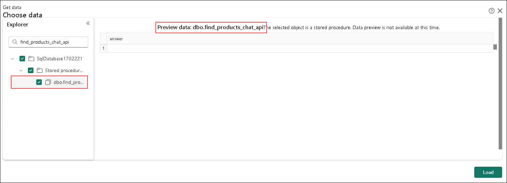
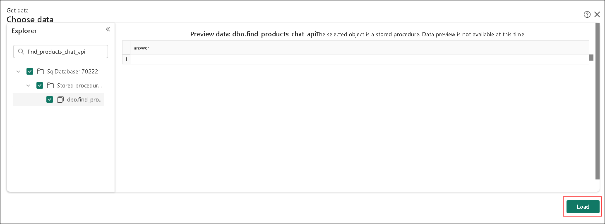

# Exercise 4: Building an AI-Powered Product Search System with GraphQL, Vector Embeddings, and Azure OpenAI

In this exercise, you will deploy a GraphQL API that combines embeddings, vector similarity search, and relational data to return relevant Adventure Works products for a chat application using a Large Language Model (LLM). You will create a stored procedure to handle questions and return product results via the GraphQL API.

## Task 1: Creating the stored procedure used by the GraphQL API

1. Navigate to query sheet, **remove the previous code** by highlighting it and pressing delete/backspace.

1. Using an empty query sheet in Microsoft Fabric, copy and paste the following code:

    ```SQL
    create or alter procedure [dbo].[find_products]
    @text nvarchar(max),
    @top int = 10,
    @min_similarity decimal(19,16) = 0.80
    as
    if (@text is null) return;
    declare @retval int, @qv vector(1536);
    exec @retval = dbo.create_embeddings @text, @qv output;
    if (@retval != 0) return;
    with vector_results as (
    SELECT 
            p.Name as product_name,
            ISNULL(p.Color,'No Color') as product_color,
            c.Name as category_name,
            m.Name as model_name,
            d.Description as product_description,
            p.ListPrice as list_price,
            p.weight as product_weight,
            vector_distance('cosine', @qv, p.embeddings) AS distance
    FROM
        [SalesLT].[Product] p,
        [SalesLT].[ProductCategory] c,
        [SalesLT].[ProductModel] m,
        [SalesLT].[vProductAndDescription] d
    where p.ProductID = d.ProductID
    and p.ProductCategoryID = c.ProductCategoryID
    and p.ProductModelID = m.ProductModelID
    and p.ProductID = d.ProductID
    and d.Culture = 'en')
    select TOP(@top) product_name, product_color, category_name, model_name, product_description, list_price, product_weight, distance
    from vector_results
    where (1-distance) > @min_similarity
    order by    
        distance asc;
    GO
    ```

1. Click on **Run** button on the query sheet.

    

1. The expected output is as below.

    

1. Next, we need to encapsulate the stored procedure into a wrapper so that the result set can be utilized by our GraphQL endpoint. Using the WITH RESULT SET syntax allows you to change the names and data types of the returning result set. This is needed in this example because the usage of sp_invoke_external_rest_endpoint and the return output from extended stored procedures. 
    
    Using an empty query sheet in Microsoft Fabric, copy and paste the following code:

    ```SQL
    create or alter procedure [find_products_api]
        @text nvarchar(max)
        as 
        exec find_products @text
        with RESULT SETS
        (    
            (    
                product_name NVARCHAR(200),    
                product_color NVARCHAR(50),    
                category_name NVARCHAR(50),    
                model_name NVARCHAR(50),    
                product_description NVARCHAR(max),    
                list_price INT,    
                product_weight INT,    
                distance float    
            )
        )
    GO
    ```

1. Click on **Run** button on the query sheet.

    

1. The expected output is as below.

    

1. You can test this newly created procedure to see how it will interact with the GraphQL API by running the following SQL in a blank query editor in Microsoft Fabric:

    ```SQL
    exec find_products_api 'I am looking for a red bike'
    ```

    The expected output is as below.
    
    

1. To create the GraphQL API, click on the **New API for GraphQL** button on the toolbar.

    

1. In the **New API for GraphQL** dialog box, use the **Name Field** and name the API as `find_products_api`.

    

1. After naming the API, click the **Create** button.

    

1.  The next dialog box presented is the **Choose data** dialog box where you will pick a table or stored procedure for the GraphQL API, 

    

1. Use the **Search box** in the **Explorer section** on the left 
    
    

1. Enter in `find_products_api` in the search box.

    

1. Select the **find_products_api stored procedure** from the search results. To confirm you’ve selected the correct one, hover over it with your mouse. The **Preview section** will display the selected database item, showing **"Preview data: dbo.find_products_api"**.

    

1. Once you have selected the **find_products_api stored procedure**, click **Load** button on the bottom right of the modal dialog box.

    

1. You will now be on the **GraphQL Query editor page**. Here, we can run GraphQL queries similar to how we can run T-SQL queries on the query editor.

    

1. Replace the sample code on the left side of the GraphQL query editor with the following query:

    ```graphql
    query {
        executefind_products_api(text: "I am looking for a red bike") {
                product_name
                product_color
                category_name
                model_name
                product_description
                list_price
                product_weight
                distance 
        }
    }
    ```

    

1. Now, click the **Run** button in the upper left of the GraphQL query editor. 

    

1. You can scroll through the results from the GraphQL query in the lower section of the editor.

    

1. Back on the toolbar, find and click the **Generate code** button.

    

1. This feature will generate the code for calling this API via **Python or node.js** to help give you a jumpstart in the application creation process.

    

1. When done looking the python and node.js code, click the **X** in the upper right corner to close the Generate code dialog box.

    

## Task 2: Adding chat completion to the GraphQL API

The API you just created could now be handed off to an application developer to be included in a RAG application that uses vector similarity search and data from the database. The application may also at some point hand the results off to a LLM to craft a more human response. 

Let's alter the stored procedure to create a new flow that not only uses vector similarity search to get products based on a question asked by a user, but to take the results, pass them to Azure OpenAI Chat Completion, and craft an answer they would typically see with an AI chat application.

1. To begin creating new stored procedures, return to the **SQL Database** home page. Use the navigator on the left side of the page and click the **SQL Database** icon.

    

1. The first step in augmenting our RAG application API is to create a stored procedure that takes the retrieved products and passes them in a prompt to an Azure OpenAI Chat Completion REST endpoint (this is the same endpoint that was used to ask the llama joke). The prompt consists of telling the endpoint who they are, what products they have to work with, and the exact question that was asked by the user. 

    Using an empty query sheet in Microsoft Fabric, copy and paste the following code:

    ```SQL
    CREATE OR ALTER PROCEDURE [dbo].[prompt_answer]
    @user_question nvarchar(max),
    @products nvarchar(max),
    @answer nvarchar(max) output

    AS

    declare @url nvarchar(4000) = N'<inject key="openaiendpoint"></inject>openai/deployments/gpt-4/chat/completions?api-version=2024-06-01';
    declare @payload nvarchar(max) = N'{
        "messages": [
            {
                "role": "system",
                "content": "You are a sales assistant who helps customers find the right products for their question and activities."
            },
            {
                "role": "user",
                "content": "The products available are the following: ' + @products + '"
            },
            {
                "role": "user",
                "content": " ' + @user_question + '"
            }
        ]
    }';

    declare @ret int, @response nvarchar(max);

    exec @ret = sp_invoke_external_rest_endpoint
        @url = @url,
        @method = 'POST', 
        @payload = @payload,
        @credential = [<inject key="openaiendpoint"></inject>],    
        @timeout = 230,
        @response = @response output;

    select json_value(@response, '$.result.choices[0].message.content');

    GO
    ```

1. Click on **Run** button on the query sheet.

    

1. The expected output is as below.

    

1. Now that you have created the chat completion stored procedure, we need to create a new find_products stored procedure that adds a call to this chat completion endpoint. This new stored procedure contains 1 additional step that was not found in the original: 
    
    A section to help package up the results into something we can use in a prompt.
    
    ```SQL-nocopy
    SELECT 
    STRING_AGG(
        CONCAT(
            COALESCE(CAST(Name AS NVARCHAR(MAX)), ''), ' ',
            COALESCE(CAST(Color AS NVARCHAR(MAX)), ''), ' ',
            COALESCE(CAST(Weight AS NVARCHAR(MAX)), ''), ' ',
            COALESCE(CAST(Size AS NVARCHAR(MAX)), ''), ' ',
            COALESCE(CAST(ProductModelID AS NVARCHAR(MAX)), '')
        ),
        CHAR(13)
    ) AS aggregated_product_info
    FROM [SalesLT].[Product];   
    ```

1. Click on **Run** button on the query sheet.

    

1. The expected output is as below.

    

1. Copy and run the following SQL in a blank query editor in Microsoft Fabric:

    ```SQL
    create or alter procedure [dbo].[find_products_chat]
    @text nvarchar(max),
    @top int = 3,
    @min_similarity decimal(19,16) = 0.70
    as
    if (@text is null) return;
    declare @retval int, @qv vector(1536), @products_json nvarchar(max), @answer nvarchar(max);
    exec @retval = dbo.create_embeddings @text, @qv output;
    if (@retval != 0) return;
    with vector_results as (
    SELECT 
            p.Name as product_name,
            ISNULL(p.Color,'No Color') as product_color,
            c.Name as category_name,
            m.Name as model_name,
            d.Description as product_description,
            p.ListPrice as list_price,
            p.weight as product_weight,
            vector_distance('cosine', @qv, p.embeddings) AS distance
    FROM
        [SalesLT].[Product] p,
        [SalesLT].[ProductCategory] c,
        [SalesLT].[ProductModel] m,
        [SalesLT].[vProductAndDescription] d
    where p.ProductID = d.ProductID
    and p.ProductCategoryID = c.ProductCategoryID
    and p.ProductModelID = m.ProductModelID
    and p.ProductID = d.ProductID
    and d.Culture = 'en')
    select
    top(@top)
    @products_json = (STRING_AGG (CONVERT(NVARCHAR(max),CONCAT( 
                                    product_name, ' ' ,
                                    product_color, ' ',
                                    category_name, ' ', 
                                    model_name, ' ', 
                                    product_description, ' ',
                                    list_price, ' ',
                                    product_weight )), CHAR(13)))
    from vector_results
    where (1-distance) > @min_similarity
    group by distance
    order by    
        distance asc;

    set @products_json = (select REPLACE(REPLACE(@products_json, CHAR(13), ' , '), CHAR(10), ' , '));

    exec [dbo].[prompt_answer] @text, @products_json, @answer output;

    GO
    ```

1. Click on **Run** button on the query sheet.

    

1. The expected output is as below.

    

1. The last step before we can create a new GraphQL endpoint is to wrap the new find products stored procedure. Copy and run the following SQL in a blank query editor in Microsoft Fabric:

    ```SQL
      create or alter procedure 
      [find_products_chat_api]
          @text nvarchar(max)
          as 
          exec find_products_chat @text
          with RESULT SETS
          (    
              (    
                  answer NVARCHAR(max)
              )
          )
      GO
    ```

1. Click on **Run** button on the query sheet.

    

1. The expected output is as below.

    

1. You can test this new  procedure to see how Azure OpenAI will answer a question with product data by running the following SQL in a blank query editor in Microsoft Fabric:

    ```SQL
    exec find_products_chat_api 'I am looking for a red bike'
    ```

    with the answer being similar to (your answer will be different): **"It sounds like the Road-650 Red, 62 Red Road Bikes Road-650 would be an excellent choice for you. This value-priced bike comes in red and features a light, stiff frame that is known for its quick acceleration. It also incorporates many features from top-of-the-line models. Would you like more details about this bike or help with anything else?"**

    

1. To create the GraphQL API, click on the **New API for GraphQL** button on the toolbar just as you did previously.

    

1. In the **New API for GraphQL** dialog box, use the **Name Field** and name the API `find_products_chat_api`.

    

1. After naming the API, click the **Create** button.

    

1.  The next dialog box presented is again the **Choose data** dialog box where you will pick a table or stored procedure for the GraphQL API.

    

1. Use the **Search box** in the **Explorer section** on the left. 
    
    

1. Enter in `find_products_chat_api` in the search box.

    

1. Choose the stored procedure in the results. You can ensure it is the **find_products_chat_api stored procedure** by hovering over it with your mouse/pointer. It will also indicate the selected database item in the preview section. It should state **"Preview data: dbo.find_products_chat_api"**.

    

1. Once you have selected the **find_products_chat_api stored procedure**, click the **Load button** on the bottom right of the modal dialog box.

    

1. You will now be back on the **GraphQL Query editor page**.

    

1. Replace the sample code on the left side of the GraphQL query editor with the following query and click the **Run** button in the upper left of the GraphQL query editor.

    ```graphql
    query {
        executefind_products_chat_api(text: "I am looking for padded seats that are good on trails") {
                answer
        }
    }
    ```

    

1. You can review the response in the **Results** section of the editor.

    

1. Try it again with the following code and see what answer the chat completion endpoint provides!

    ```graphql
    query {
        executefind_products_chat_api(text: "Do you have any racing shorts?") {
                answer
        }
    }
    ```

## Task 3: Creating a Power BI Report from a SQL Database in Microsoft Fabric with Copilot

It's easy to quickly create reports in Power BI with SQL database in Fabric using Copilot. 

### Build a new report with Copilot

1. In the navigator on the left side of the Microsoft Fabric page, **click the tile for your database**. It will be named **SqlDatabase<inject key="DeploymentID" enableCopy="false"/>**.

    

1. Now on the database details page, find the **SQL database dropdown** in the upper right of the page.

    

1. Click the **SQL database dropdown** and select **SQL analytics endpoint**.

    

    > **Note**: You can also get to the SQL analytics endpoint by clicking on your workspace tile, and selecting the SQL analytics endpoint on the bottom of the page.
    
      

1. On the SQL database analytics endpoint details page, click the **Reporting tab** from the ribbon.

    

1. Now, click the **New Report** button.

    

1. When the **New report with all available data modal** dialog opens, click the **Continue** button to create a new report with all available data.

    

    > **Note:** If you get an error after clicking the Continue button saying: **"Unable to add the selected objects because_least one of them has been removed from the source. Please refresh and try again."**, Close the dialog box and reopen it. Then, click the Continue button again.

1. The **Upgrade to a paid Power BI license** modal window will appear next. Click on **Try free** button.

    

1. Confirm the free license on the following model by clicking the **Got it** button.

    

1. Once the new report opens in Power BI, click the **Try it** button in the callout box with title **Create a report with Copilot**.

    

1. On the **right side** of the page, the **Copilot blade** opens.

    

1. Click the **Get started** button.

    

1. Copilot presents some questions to get you started. Click **Suggest content for a new report page**.

    

1. Suggested outlines for your report are returned by Copilot based on the data it has access to in the analytics endpoint. 

    > **Note:** The suggested reports returned by Copilot may differ from the following images.

    

1. Click the **+ Create button** for the **Order Details** report **or any other report** you would like to create.

    

1. Copilot will then begin creating your report.

    

1. You now have a Power BI report of your SQL database data.

    > **Note:** The generated Power BI reports returned by Copilot may differ from the following images.

    

1. **Minimize the blades** and **Close Copilot chat** to expand the size of the report.

    

### Summary

In this lab, you created a GraphQL API for RAG (Retrieval-Augmented Generation) applications using Microsoft Fabric's SQL capabilities with vector embeddings. You built a stored procedure for vector similarity search on Adventure Works products, integrated it into a GraphQL endpoint, and enhanced it with Azure OpenAI's chat completion for natural language responses. Finally, you created a Power BI report using Copilot, demonstrating how the same database supports both AI-powered search and business intelligence. This lab highlights combining vector search, relational data, and LLMs for AI-driven product search and recommendations.

### You have successfully completed the lab!!
