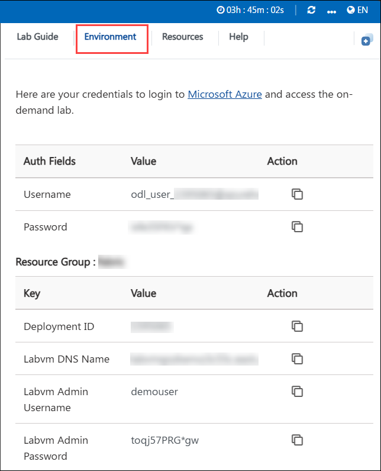
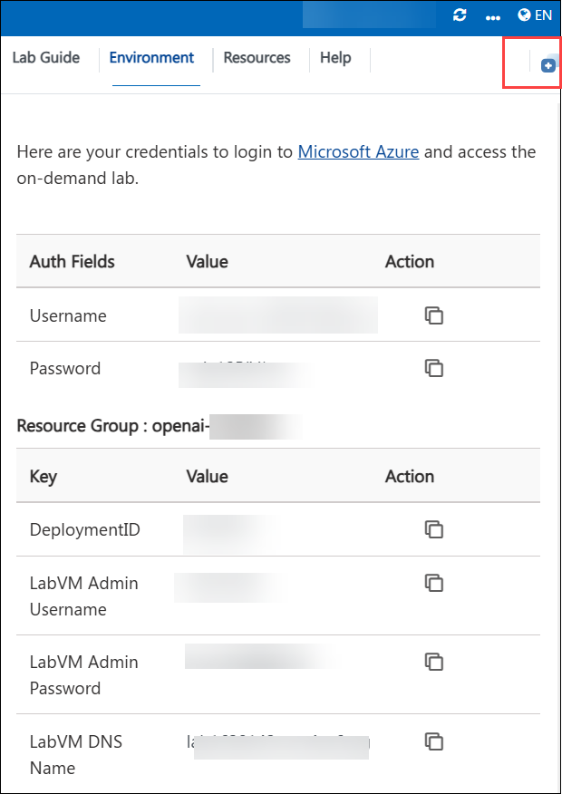
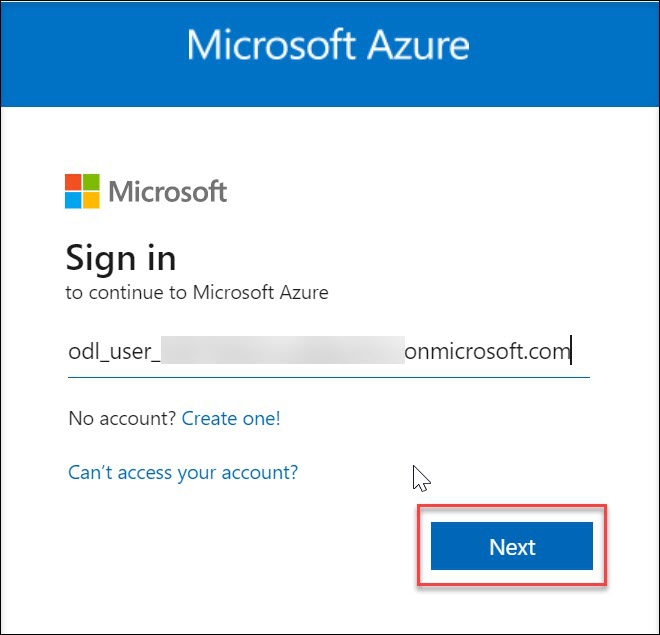
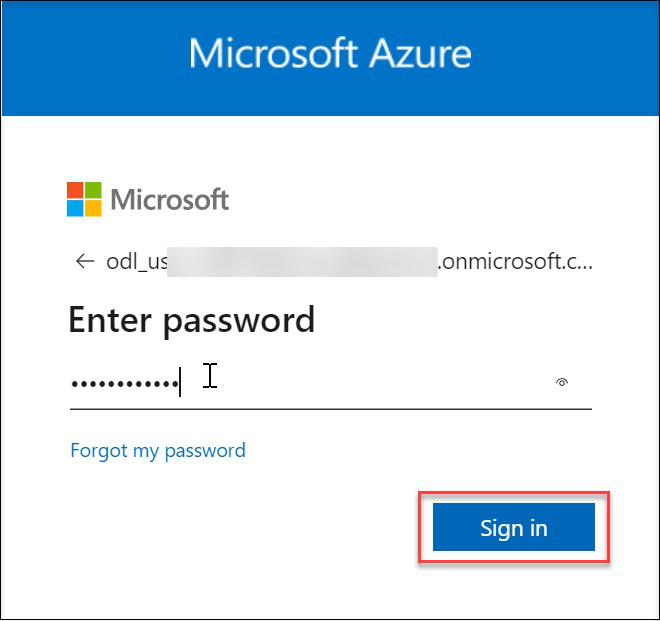

# Build an AI App with SQL DB in Fabric
 
### Overall Estimated Duration: 90 minutes
 
## Overview
 
In this lab, you will learn how to build an AI-powered product search system by integrating Microsoft Fabric's SQL capabilities with Azure OpenAI services. The lab guides you through creating a GraphQL API that leverages vector embeddings and relational data for semantic search and retrieval-augmented generation (RAG) applications. You will also explore how to enhance the API with Azure OpenAI's chat completion functionality to provide natural language responses. Finally, you will use Power BI and Copilot to create business intelligence reports, showcasing how the same database can serve both AI-driven applications and reporting needs.
 
## Objective
 
By the end of this lab, you will be able to:

- Create and manage a SQL database in Microsoft Fabric.
- Integrate Azure OpenAI services with SQL databases for embeddings, chat completions, and REST endpoint invocations.
- Build a GraphQL API for semantic search using vector similarity and relational data.
- Enhance the API with Azure OpenAI to generate natural language responses.
- Use Power BI and Copilot to create interactive reports from SQL database data.
 
## Prerequisites
 
Participants should have:

- **Familiarity with Azure**: Basic understanding of Azure services and the Azure portal.
- **Knowledge of SQL**: Experience with writing and executing SQL queries.
- **Basic Knowledge of Microsoft Fabric**: Understanding of Fabric concepts, including SQL databases and integration workflows.

## Architecture

This architecture leverages Microsoft Fabric to build an AI-powered application that integrates SQL database capabilities, Azure OpenAI services, and business intelligence reporting. The process begins with the creation of a Fabric workspace and SQL database, where sample product data is loaded and managed. Using Fabric’s SQL capabilities, vector embeddings are generated for product data via Azure OpenAI, enabling semantic search and retrieval-augmented generation (RAG) scenarios. Stored procedures and external REST endpoint invocations facilitate seamless integration with Azure OpenAI for tasks such as chat completion and content safety. A GraphQL API is then created to expose these AI-powered search and chat functionalities to downstream applications. Finally, Power BI and Copilot are used to generate interactive reports directly from the SQL database, demonstrating how the same data foundation supports both AI-driven applications and advanced analytics within the unified Fabric environment.

## Architecture Diagram

## Explanation of Components
 
The architecture for this lab involves the following key components:

- **Microsoft Fabric Workspace:** The central environment where all resources—such as SQL databases, APIs, and reports—are created and managed.

- **SQL Database (Fabric):** Serves as the primary data store, hosting structured product and business data used for both AI and analytics scenarios.

- **Sample Data Loader:** A built-in tool to quickly populate the SQL database with sample datasets (e.g., Adventure Works), enabling hands-on experimentation.

- **Azure OpenAI Integration:** Provides advanced AI capabilities such as generating vector embeddings for semantic search, chat completions, and content safety, all accessible via REST endpoints.

- **Stored Procedures:** Encapsulate business logic for vector similarity search and AI-powered queries, acting as the backend for the GraphQL API.

- **GraphQL API:** Exposes the stored procedures and AI-powered search capabilities as endpoints, allowing external applications to perform semantic product search and chat interactions.

- **Copilot:** An AI assistant integrated throughout Fabric, assisting with SQL queries, API creation, and Power BI report generation to streamline development and analytics tasks.

- **Power BI:** Connects directly to the SQL database to create interactive reports and dashboards, enabling business users to visualize and analyze the same data used by AI applications.

## Getting Started with the Lab
Welcome to Fabric OneLake as Central Storage Lab ! , We've prepared a seamless environment for you to explore and learn. Let's begin by making the most of this experience.

> Note: If a PowerShell window appears once the environment is active, please don't close it. Minimize it instead of closing it and proceed with the tasks.

## Accessing Your Lab Environment

Once you're ready to dive in, your virtual machine and Lab guide will be right at your fingertips within your web browser.

### Virtual Machine & Lab Guide

Your virtual machine is your workhorse throughout the workshop. The lab guide is your roadmap to success.

## Exploring Your Lab Resources

To get a better understanding of your lab resources and credentials, navigate to the **Environment** tab.

## Utilizing the Split Window Feature

For convenience, you can open the lab guide in a separate window by selecting the **Split Window** button from the Top right corner.

## Managing Your Virtual Machine

Feel free to start, stop, or restart your virtual machine as needed from the **Resources** tab. Your experience is in your hands!

##  Lab Guide Zoom In/Zoom Out

To adjust the zoom level for the environment page, click the **A↕ : 100%** icon located next to the timer in the lab environment.

## Let's Get Started with Azure Portal

1. In the JumpVM, click on **Azure portal** shortcut of Microsoft Edge browser which is created on desktop.

1. On the **Sign into Microsoft Azure** tab, you will see the login screen. Enter the provided email or username, and click **Next** to proceed.

    - Email/Username: 

    

1. Now, enter the following password and click on **Sign in**.

    - Password: 

    

    > Note: If you see the Action Required dialog box, then select Ask Later option.

1. If you see the pop-up Stay Signed in?, click No.

    

1. If you see the pop-up **You have free Azure Advisor recommendations!**, close the window to continue the Lab.

1. If a Welcome to Microsoft Azure popup window appears, click **Cancel** to skip the tour.

    

## Support Contact

The CloudLabs support team is available 24/7, 365 days a year, via email and live chat to ensure seamless assistance at any time. We offer dedicated support channels tailored specifically for both learners and instructors, ensuring that all your needs are promptly and efficiently addressed.Learner Support Contacts:

  - Email Support: cloudlabs-support@spektrasystems.com    
  - Live Chat Support: https://cloudlabs.ai/labs-support

Now, click on Next from the lower right corner to move on to the next page.

### Happy Learning!!