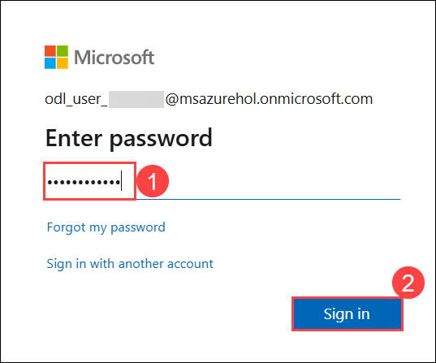

# Build an AI App with SQL DB in Fabric
 
### Overall Estimated Duration: 90 minutes
 
## Overview
 
In this lab, you will learn how to build an AI-powered product search system by integrating Microsoft Fabric's SQL capabilities with Azure OpenAI services. The lab guides you through creating a GraphQL API that leverages vector embeddings and relational data for semantic search and retrieval-augmented generation (RAG) applications. You will also explore how to enhance the API with Azure OpenAI's chat completion functionality to provide natural language responses. Finally, you will use Power BI and Copilot to create business intelligence reports, showcasing how the same database can serve both AI-driven applications and reporting needs.

## Architecture

The arc diagram for “Build an AI App with SQL DB in Fabric” illustrates the interconnected roles of four key components: GraphQL, SQL Database, Machine Learning Model, and Microsoft Fabric. At one end, GraphQL acts as the interface for data queries from the application. These queries retrieve or send data to the SQL Database, which stores and organizes structured data. The Machine Learning Model processes this data to generate intelligent insights. Microsoft Fabric ties everything together, enabling seamless data flow, orchestration, and deployment across the components, creating a unified and scalable AI application environment.

## Architecture Diagram


## Explanation of Components
 
The architecture for this lab involves the following key components:

1. **GraphQL** A query language that allows the frontend or API consumers to request exactly the data they need. In this context, it connects the application to backend services and facilitates efficient data queries from the AI layer or SQL database.

2. **Machine Learning Model** The core of the AI app, trained to perform tasks like recommendations, classification, or embeddings. It processes data (often coming from the SQL DB) and provides intelligent outputs that drive app features.

3. **SQL Database** Stores structured data used for both training machine learning models and serving insights. In Microsoft Fabric, this could be an integrated SQL endpoint that connects with other services like Data Factory or Synapse.

4. **Microsoft Fabric** The unified data platform by Microsoft that connects data ingestion, processing, and analysis services. It orchestrates the flow between the SQL database, the ML models, and application layers like GraphQL.

## Getting Started with the Lab

Welcome to the Developing AI Applications Using SQL Database in Microsoft Fabric Workshop! We've prepared a seamless environment for you to explore and learn. Let's begin by making the most of this experience.

> **Note:** Once the environment is active, if a PowerShell window appears, **DO NOT CLOSE IT**. Please minimize the window and continue with the tasks as instructed.

## Accessing Your Lab Environment

Once you're ready to dive in, your virtual machine and Lab guide will be right at your fingertips within your web browser.


### Virtual Machine & Lab Guide

Your virtual machine is your workhorse throughout the workshop. The lab guide is your roadmap to success.

## Exploring Your Lab Resources

To get a better understanding of your lab resources and credentials, navigate to the **Environment** tab.


## Utilizing the Split Window Feature

For convenience, you can open the lab guide in a separate window by selecting the **Split Window** button from the Top right corner.


## Managing Your Virtual Machine

Feel free to start, stop, or restart your virtual machine as needed from the **Resources** tab. Your experience is in your hands!


##  Lab Guide Zoom In/Zoom Out

To adjust the zoom level for the environment page, click the **A↕ : 100%** icon located next to the timer in the lab environment.


## Let's Get Started with Power BI Portal
 
1. On the Lab VM, open **Microsoft Edge** from the desktop. In a new tab, navigate to **Microsoft Fabric** by copying and pasting the following URL into the address bar:

   ```
   https://app.fabric.microsoft.com/home
   ```

2. On the **Enter your email, we'll check if you need to create a new account** tab you will see the login screen, in that enter the following email/username, and click on **Submit**.
 
   - **Email/Username:** <inject key="AzureAdUserEmail"></inject>
 
     
 
3. Now enter the following password and click on **Sign in**.
 
   - **Password:** <inject key="AzureAdUserPassword"></inject>
 
     
     
1. If you see the pop-up **Stay Signed in?**, select **No**.

   

1. You will be navigated to the **Microsoft** **Fabric Home page**.

    

1. On Welcome to the Fabric view dialog opens, click **Cancel**.

    

## Support Contact

The CloudLabs support team is available 24/7, 365 days a year, via email and live chat to ensure seamless assistance at any time. We offer dedicated support channels tailored specifically for both learners and instructors, ensuring that all your needs are promptly and efficiently addressed. Learner Support Contacts:

  - Email Support: cloudlabs-support@spektrasystems.com    
  - Live Chat Support: https://cloudlabs.ai/labs-support

Now, click on Next from the lower right corner to move on to the next page.


### Happy Learning!!
